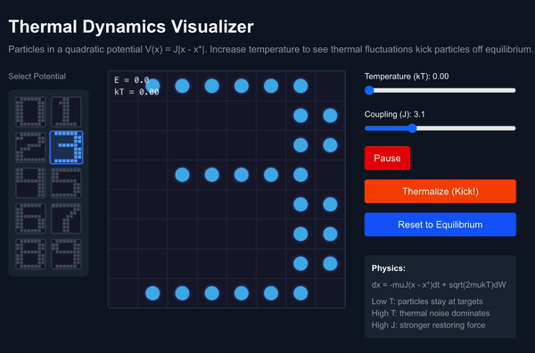

# The Criticality Engine

**On-chip learning for thermodynamic computers via the Onsager-Machlup action.**



*Particles relaxing to equilibrium digit configurations via Langevin dynamics. Increase temperature → decoherence. Lower temperature → pattern recovery.*

---

## What This Is

Thermodynamic computers use physical fluctuations (thermal noise, stochastic switching) to perform computation. Devices like CMOS p-bits, nanomagnets, and analog relaxation circuits naturally implement Langevin dynamics—no simulation required.

**The problem**: existing thermodynamic hardware can do inference, but nobody has figured out how to *train* on-chip. Without learning, you're stuck with fixed models.

**Our contribution**: We derive closed-form gradient estimators from the Onsager-Machlup action that enable fully local, on-chip learning. A thermodynamic computer can update its parameters by observing its own trajectories—no backpropagation, no external compute.

## The Core Idea

The Onsager-Machlup action measures how well parameters explain observed dynamics. When parameters are correct, trajectories become maximally likely. This gives us analytical gradients:

```
∂L/∂b_i  ∝  (observed velocity - predicted velocity)_i
∂L/∂J_ij ∝  residual_i · x_j + residual_j · x_i
```

These are **local**: each parameter update requires only measurements at neighboring nodes. No gradient tape. No chain rule. The physics gives you the gradient directly.

## Hardware Architecture

The Criticality Engine architecture consists of:

1. **T-array**: Grid of stochastic nodes undergoing Langevin dynamics
2. **Measurement plane**: Samples node states at each timestep
3. **Local statistics layer**: Computes velocity residuals from consecutive samples
4. **Gradient engine**: Applies the O-M formulas to get parameter updates
5. **Reconfiguration fabric**: Updates couplings J_ij and biases b_i via DACs

**Learning happens in N clock cycles** per trajectory observation. No iterative optimization—just measure, compute residual, update. The hardware naturally performs gradient descent by observing its own thermal fluctuations.

## Simulation Validation

We validate the gradient formulas by simulating thermodynamic dynamics on MNIST:

- **Thermal pixel exchanges** model mass-conserving Kawasaki dynamics
- **Trajectory observation** extracts gradients via Eq. 12
- **Within-class centering** proves we learn correlations, not just templates

The simulation confirms the formulas work: parameters converge, classification improves, and learned couplings capture genuine structure. This is a proof of concept—the real target is physical hardware where these dynamics happen naturally.

```bash
# Run the simulation
uv sync
uv run python learn_couplings.py
```

## Repository Structure

```
├── learn_couplings.py          # Simulation of thermal dynamics + learning
├── parameter_recovery.py       # Validates gradient formulas recover true parameters
├── thermal-viz/                # Interactive Next.js visualizer (run: npm run dev)
├── morisse-whitelam.tex/pdf    # Full paper with theory + hardware design
└── paper_figures/              # Generated visualizations
```

## The Paper

`morisse-whitelam.pdf` contains:

- Derivation of gradient estimators from Onsager-Machlup action
- Hardware architecture blueprint (T-array, measurement plane, gradient engine)
- CMOS implementation using p-bits at threshold
- Comparison to Equilibrium Propagation and Boltzmann machines
- Learning as constraint satisfaction (not optimization)

## Citation

```bibtex
@article{morisse2025criticality,
  title={The Criticality Engine: Online Learning in Thermodynamic Neural Computers},
  author={Morisse, Alexander and Whitelam, Stephen and Tamblyn, Isaac},
  year={2025}
}
```

---

*The next generation of AI might run on thermal noise—if we can figure out how to train it.*
